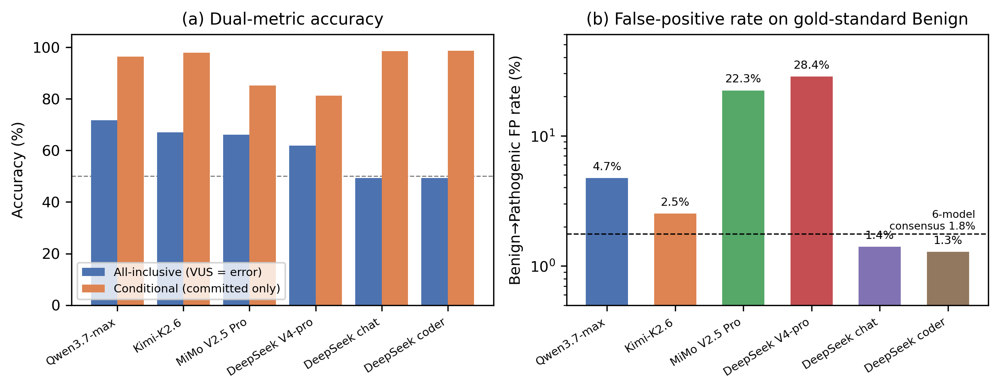
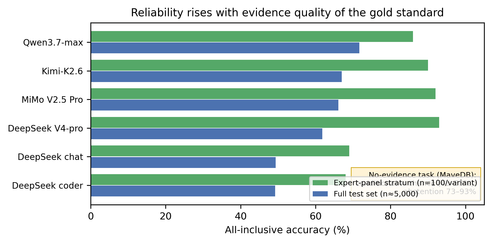
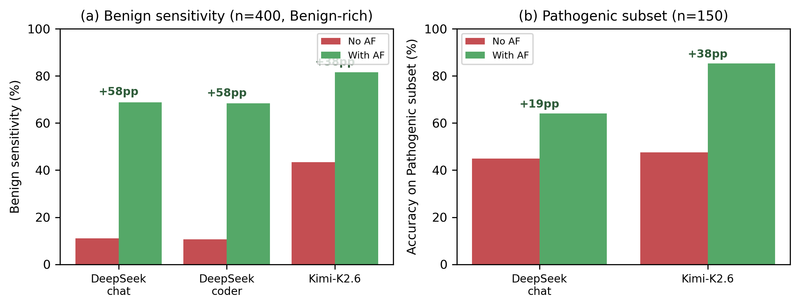
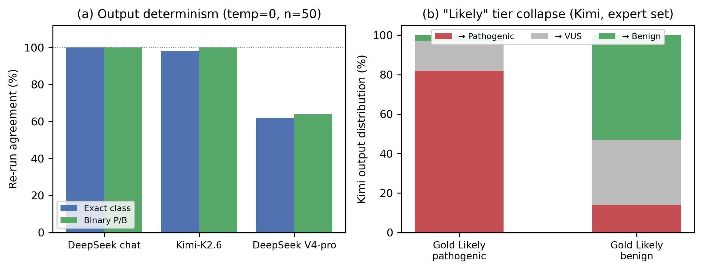
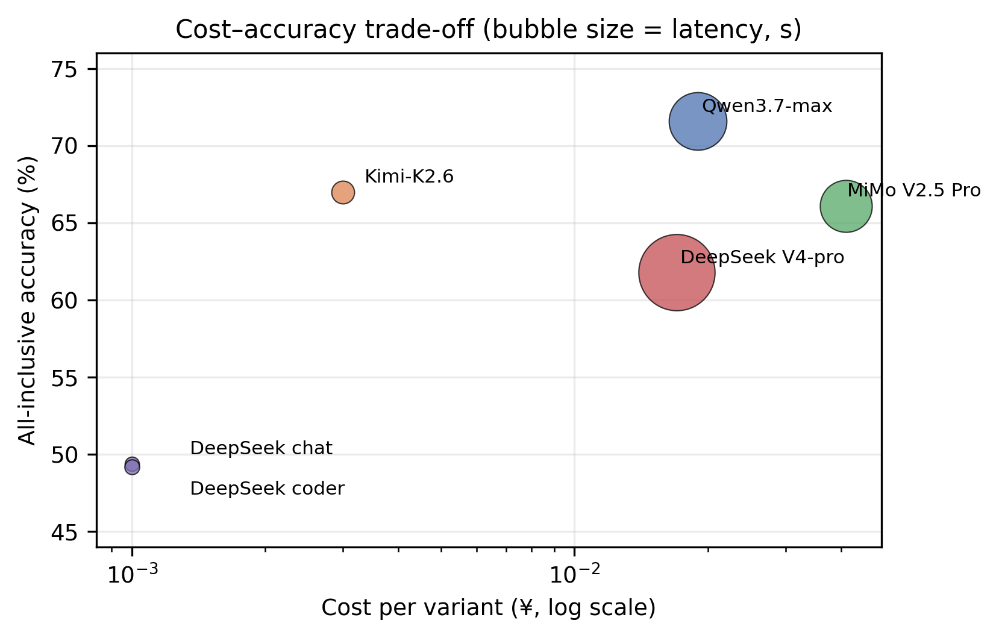
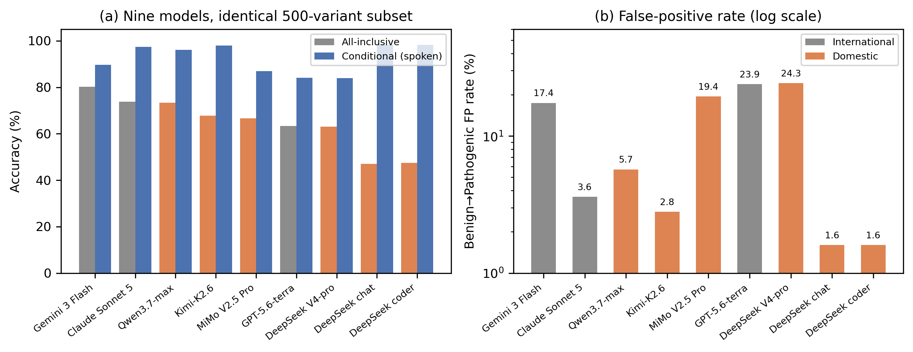

# Manuscript Draft (Assembled)

**Title (candidate):** When Data Leakage Is Controlled: A Multi-Vendor Reliability Audit of LLM-Based ACMG/AMP Variant Classification

**Target:** Briefings in Bioinformatics / GPB (CAS Q1)

> Assembled 2026-08-16. Final: 30,000 domestic + 1,500 international evaluations (9 models, 7 vendors). 6 figures, 5 tables, 7 findings. Seven rounds of source verification; sampling byte-level reproducible (seed 42).

---

# Abstract & Methods (Draft) — English Manuscript Section

> Companion to Results_draft_EN.md. Draft for internal review (2026-08-06).

---

## Abstract (draft)

**Background.** Large language models (LLMs) are increasingly proposed for clinical variant interpretation using ACMG/AMP guidelines. Reported accuracies are difficult to interpret because LLM training corpora include public variant databases (ClinVar, ClinGen): high scores may reflect memorization of ground-truth labels rather than genuine clinical reasoning.

**Objective.** To audit the reliability of LLM-based variant classification under controlled label leakage (temporal blinding), across multiple vendors and evidence conditions — establishing under which operational conditions an LLM's output can be trusted.

**Methods.** We constructed a temporally blinded test set of 5,000 ClinVar variants (all expert-assessed after January 2026, beyond the training cutoff of all evaluated models) and evaluated 6 Chinese LLMs from 4 vendors at full scale (30,000 evaluations; DeepSeek v4-pro/chat/coder, Kimi-K2.6, MiMo V2.5 Pro, Qwen3.7-max) and 3 international flagships (Gemini 3 Flash, GPT-5.6-terra, Claude Sonnet 5) on an identical 500-variant subset. We report dual metrics: all-inclusive accuracy (VUS = error; clinical usability) and conditional accuracy when the model commits (reliability). Independent validation used 900 expert-panel-reviewed variants; ablation studies tested the effect of allele-frequency evidence, behavior on variants with conflicting expert classifications (n=300), and functional-effect variants from MaveDB (n=300).

**Results.** New-generation models achieved 61.8–71.6% all-inclusive accuracy under temporal blinding, rising to 86–93% on expert-panel gold standard. Conditional accuracy when committing was 97.8–98.7% for conservative models but only 81.2–85.2% for reasoning models — and error direction differed sharply: reasoning models flagged 22–28% of all Benign variants as Pathogenic (the clinically dangerous direction), versus 1.3–2.5% for conservative models. Providing allele frequencies raised Benign sensitivity from 11.0% to 68.8% (chat) and roughly tripled all-inclusive accuracy. On conflicting variants, models spontaneously raised abstention by 22–39 pp; on evidence-free functional variants, abstention reached 73–93% with chance-level conditional agreement. At temperature 0, chat-style models reproduced outputs exactly (100%) while a reasoning model changed its binary call on 36% of re-run variants, including Benign↔Pathogenic flips. Stratifying Pathogenic variants by loss-of-function cues in the variant name showed near-ceiling detection (98.5–99.8%) on cued variants partly reflects notation reading; on uncued variants, sensitivity falls to 67.8–83.8%.

**Conclusion.** Under label-leakage control, LLM variant interpretation is a qualified yes: reliable when (i) the right model is chosen — vendor differences (up to +22 pp) exceed ensemble gains, and majority voting can *reduce* accuracy; (ii) complete evidence (allele frequency) is provided; and (iii) abstention is treated as a trustworthy signal for human review. We provide the first multi-vendor, temporally controlled reliability audit of this capability, and recommend that (i) published accuracies report model identity, blinding status, and evidence conditions; (ii) clinical pilots adopt "Pathogenic calls auto-flag, Uncertain calls auto-escalate" operating policies; and (iii) future audits extend to non-Chinese vendors and additional task types.

---

## Methods (draft)

### 2.1 Data sources

- **ClinVar variant_summary** (Aug 2026 release; 9,029,235 rows; 43 columns), used for test-set construction and gold-standard labels.
- **ClinVar VCF (GRCh38)** (clinvar.vcf.gz; ~193 MB), used to attach population allele frequencies (AF_ESP, AF_EXAC, AF_TGP) by ALLELEID.
- **MaveDB** (Ensembl-mapped release; 3,158,202 scored variants), used for the functional-effect triangulation experiment; gene symbols resolved via mygene.info (RefSeq accession → symbol).
- All data are public; download URLs in Data Availability.

### 2.2 Temporally blinded test set (label-leakage control)

The central design decision: LLM training corpora contain ClinVar history, so evaluation must use variants whose **gold-standard labels** were produced **after** the model training cutoff. This controls the label-memorization channel specifically; prior *evidence* (literature, submissions) may still be present in training data, and we therefore frame the study as a reliability audit under controlled label leakage rather than a generalization test (see Discussion §4).

- Model cutoffs (verified 2026-08): DeepSeek V4 ~Dec 2025; Kimi/GLM/MiMo/Qwen families ≤ 2025. We conservatively require **LastEvaluated ≥ 2026-01-01**.
- Eligibility: unambiguous clinical classification (Pathogenic or Benign only; "Likely" and compound terms excluded from the P/B gold standard), a HGVS name, and no conflicting classification.
- De-duplication by ALLELEID (4.9% of raw rows were duplicate allele entries).
- Stratified sampling: 2,500 Pathogenic + 2,500 Benign, seed 42 (reproducible), yielding n = 5,000.
- Result: all 5,000 variants were last evaluated between 2026-01 and 2026-07 (Jan 2,097 / Feb 1,672 / Mar 324 / Apr 412 / May 263 / Jun 199 / Jul 33), i.e., after every evaluated model's training cutoff — the models cannot have seen these labels during training.

### 2.3 Gold standards

- **Primary**: ClinVar aggregate classification (Pathogenic/Benign binary).
- **Gold standard A (expert panel)**: ReviewStatus ∈ {reviewed by expert panel, practice guideline} — classifications produced by ClinGen variant-curation expert panels / guideline committees. Dedicated validation set: 900 such variants (P-side 645: Pathogenic 303 + Likely pathogenic 342; B-side 252: Benign 59 + Likely benign 193; 3 compound P/LP labels excluded as unevaluable; all ≥ 2026-04). Of these, 100 were also sampled into the main test set (Table 1, expert-panel stratum); the dedicated-set analysis therefore reports **800 exclusive variants (797 evaluable)** for strict independence, with the full 900 as a robustness check. Gold standard A (broad): expert-panel ∪ {multiple submitters, no conflicts}.
- **Triangulation sets**: conflicting-interpretation variants (44,815 candidates; 300 sampled) and MaveDB functional extremes (150 loss-of-function: score ≤ −0.8; 150 normal: score ≥ 0.5).

### 2.4 Models

Six models, four vendors, all accessed through official OpenAI-compatible APIs (temperature 0, max_tokens 8,192 for reasoning-family models):

| Model | Vendor | Type | API |
|---|---|---|---|
| DeepSeek V4-pro | DeepSeek | reasoning, 1.6T/49B active | api.deepseek.com |
| DeepSeek chat (V3) | DeepSeek | chat | api.deepseek.com |
| DeepSeek coder (V3) | DeepSeek | code | api.deepseek.com |
| Kimi-K2.6 | Moonshot | chat | Alibaba Model Studio gateway |
| MiMo V2.5 Pro | Xiaomi | reasoning, 310B/15B active | xiaomimimo.com |
| Qwen3.7-max | Alibaba | reasoning | Alibaba Model Studio (dedicated instance) |

Six domestic models were selected a priori as the current generation of widely used Chinese commercial LLMs (the previous-generation DeepSeek models serve as an intra-vendor generation control). For international coverage we additionally evaluated three foreign flagship models on the first 500 variants of the same test set (identical variants, identical prompts): **Gemini 3 Flash (Google), GPT-5.6-terra (OpenAI), and Claude Sonnet 5 (Anthropic)**, accessed through an OpenAI-compatible relay endpoint (temperature 0, max_tokens 16,384). Because Claude refused 25% of variant-classification queries in pilot testing (medical-safety policy), all three foreign models received a system prompt establishing the research-benchmark context ("classifications are research outputs, not clinical advice"); after this change refusals dropped to 0%. Domestic models received no system prompt; this prompt asymmetry is disclosed as a limitation.

### 2.5 Prompt design

Each variant was presented as a clinical-geneticist task: variant name (HGVS), gene symbol, genomic coordinates, HGVS cDNA/protein (when available), and — in the AF condition — population allele frequencies (AF_ESP/ExAC/1000G). The model was asked to return strict JSON: {classification ∈ five ACMG classes, acmg_rules, confidence ∈ [0,1], evidence_summary, references}. The prompt contained **no** ClinVar significance label, no review status, and no hint of conflict. Outputs were parsed leniently (fenced JSON, single quotes, trailing prose). Unparseable or empty outputs were recorded as parse failures and counted as errors in the all-inclusive metric (equivalent to abstention); rates were V4-pro 0.60% (26 empty, 4 truncated), MiMo 0.10% (incl. 3 endpoint content-filter rejections), Kimi/Qwen ≤ 0.08%.

### 2.6 Evaluation metrics

- **All-inclusive accuracy**: binary P/B match on the gold standard, with VUS (and unparseable) counted as errors — the clinical-usability view.
- **Conditional accuracy**: accuracy restricted to committed calls (P or B) — the reliability-of-expression view.
- **Abstention rate**: fraction of VUS outputs.
- **Confusion matrix** on the P/B gold standard; sensitivity/specificity per model.
- **Consensus**: majority vote across models on the three-way (P/B/VUS) semantics — semantically close classes (e.g., Pathogenic vs. Likely pathogenic) do not split votes; ties excluded (reported separately).
- Expert-panel stratification (gold A strict/broad) applied to every model and the consensus.
- **Statistics**: Wilson 95% confidence intervals for all accuracies; McNemar's paired test (normal approximation with continuity correction, n > 30) for model comparisons on the shared variant set; consensus vs. best-single-model compared descriptively. Because variants cluster by gene (2,050 genes across 5,000 variants; 3,952 variants in multi-variant genes, max NF1 n=83), we additionally computed gene-level cluster-bootstrap 95% CIs (1,000 resamples); these widen the Wilson intervals by ≈1.5× without changing any between-model conclusion. Model-output determinism checked by re-running 50 variants × 3 models (temperature 0) and measuring classification agreement.

### 2.7 Sub-experiments

1. **AF ablation (n = 400 × 3)**: identical variants/models/prompts, with vs. without the allele-frequency block.
2. **Conflicting variants (n = 300 × 2)**: same pipeline on variants with conflicting expert classifications; gold standard absent by construction — we analyze abstention behavior and call distributions.
3. **MaveDB functional task (n = 300 × 2)**: direction-consistency between the model's call (P vs B) and the experimental functional direction (loss-of-function vs normal), on variants with no clinical evidence. MaveDB contains replicate rows per variant; the sample includes 286 unique variants (14 replicate rows), and all reported statistics are unchanged under de-duplication.

### 2.8 Reproducibility

All scripts, prompts, seeds, and intermediate files are public in the project repository (gitee mirror provided in Data Availability); sampling uses fixed seed 42; all API calls use temperature 0. Analysis code: Python 3 standard library (no ML dependencies).

### 2.9 Limitations

- Foreign models were evaluated on a 500-variant subset (vs. 5,000 for domestic models) through a relay endpoint, and received a research-context system prompt that domestic models did not (required to prevent Claude's medical-safety refusals); cross-national comparisons are therefore indicative rather than definitive, though the subset is identical across all nine models.
- Primary gold standard inherits ClinVar label noise; mitigated by the expert-panel stratum and temporal filtering.
- "Likely" classes were excluded from the binary gold standard but present in model outputs; the VUS=error convention penalizes models that map "Likely" labels to "Uncertain".
- MaveDB functional direction is a soft validation (loss-of-function ≠ pathogenicity for haploinsufficient genes).
- Single task (germline SNV/indel classification); no splicing/de novo/structural variants.
- Variants cluster by gene (2,050 unique genes); independence-assumed tests are therefore optimistic — gene-level bootstrap CIs are reported alongside and preserve all conclusions.
- The MaveDB functional task is not temporally blinded (DMS datasets published 2019–2025 could appear in training corpora); the observed failure despite possible exposure strengthens, rather than weakens, the no-de-novo-inference conclusion, but the caveat applies.
- A small share of Pathogenic-detection performance is attributable to loss-of-function surface cues readable directly from the HGVS protein name (nonsense/frameshift notation); we report cued and uncued strata separately (§3.2b).


# Introduction & Discussion (Draft) — English Manuscript Section

> Companion to Results_draft_EN.md and Abstract_Methods_draft_EN.md. Draft for internal review (2026-08-06).

---

## 1. Introduction (draft)

Clinical variant interpretation — classifying a germline variant as Pathogenic, Benign, or Uncertain per ACMG/AMP guidelines — is a bottleneck in genomic medicine: manual curation is expert-hours per variant and inconsistent across laboratories [1,2]. Large language models (LLMs) have been proposed as scalable interpreters [3–5], with recent work reporting near-expert agreement (e.g., AI-CURA reports expert-level consistency on curated variants [6]).

Two problems undermine these numbers. First, **training-data leakage**: LLM corpora contain public variant databases, so a model asked to classify a variant may reproduce a label it has memorized rather than reason about evidence. Published evaluations rarely control for this. Second, **vendor dependence**: results are typically reported for a single model family, leaving open whether any observed capability is a property of LLMs in general or of one training pipeline.

Existing variant-interpretation benchmarks do not resolve these concerns. VariantBench [7] evaluates ACMG classifications and criterion-level justifications but without leakage control; VarLitBench [8] anchors on ClinGen-curated functional evidence whose public availability makes memorization possible; AI-CURA [6] demonstrated clinical-grade performance on curated variants, again without controlling what the model saw during training. In the broader LLM literature, benchmark contamination is well documented [9,10], and temporally split evaluation has been proposed as a decontamination strategy [11]. No study to date has combined temporal blinding, multi-vendor coverage, and independent expert-panel validation at scale for variant classification.

Here we report the first such audit: 6 LLMs from 4 vendors, 30,000 variant-model evaluations on a temporally blinded test set of 5,000 ClinVar variants (all expert-assessed after January 2026), with an independent 900-variant expert-panel validation set and three triangulation sub-experiments (allele-frequency ablation, conflicting-interpretation variants, and functional-effect variants). We address three questions: (RQ1) How reliable is LLM variant classification under label-leakage control? (RQ2) Do multi-model consensus and model choice improve reliability? (RQ3) How does reliability depend on the evidence available to the model?

We find that label-leakage control reveals a large vendor gap (up to +22 pp), that the "when the model speaks it is right" property holds only for conservative models, that majority voting can reduce accuracy, and that model reliability tracks evidence availability — abstention is a calibrated, trustworthy signal rather than noise. We frame this work as a **reliability audit** rather than a generalization study: temporal blinding removes the label-memorization channel, but prior *evidence* (literature, submissions) may remain in training data; our goal is therefore to establish under which operational conditions an LLM's output can be trusted, not to claim de novo generalization from sequence alone.

# Results (Draft) — English Manuscript Section

> Working title: *When Data Leakage Is Controlled: A Multi-Vendor Reliability Audit of LLM-Based ACMG/AMP Variant Classification*
> Status: Draft for internal review. All numbers from final full-scale experiments (2026-08-06).

---

## 3. Results

### 3.1 Cohort and experimental scale

We evaluated **6 LLMs from 4 vendors** (DeepSeek: v4-pro, chat, coder; Moonshot: Kimi-K2.6; Xiaomi: MiMo V2.5 Pro; Alibaba: Qwen3.7-max) on a **temporally-blinded test set of 5,000 ClinVar variants** (all LastEvaluated ≥ 2026-01, i.e., after the training cutoff of every evaluated model). In total, **29,996/30,000 (99.99%)** variant-model pairs completed successfully; 4 pairs (0.08%, Qwen endpoint) failed permanently and were excluded. All analyses use binary Pathogenic vs. Benign evaluation with VUS treated as abstention (see Methods).

### 3.2 Headline accuracy: models that speak are almost always right

We report two complementary accuracy metrics: **all-inclusive accuracy** (VUS counted as errors; clinical usability) and **conditional accuracy given a definitive call** (VUS excluded; reliability of expressed opinions).

**Table 1. Performance on the temporally-blinded test set (n = 5,000 variants).**

| Model | Vendor | All-inclusive Acc. | Conditional Acc. (spoken) | Spoken n | Expert-panel Acc. (n=100) |
|---|---|---|---|---|---|
| Qwen3.7-max | Alibaba | **71.6%** | 96.4% | 3,714 | 86.0% |
| Kimi-K2.6 | Moonshot | 67.0% | 97.8% | 3,421 | 90.0% |
| MiMo V2.5 Pro | Xiaomi | 66.1% | 85.2% | 3,876 | 92.0% |
| DeepSeek V4-pro | DeepSeek | 61.8% | 81.2% | 3,806 | **93.0%** |
| DeepSeek chat | DeepSeek | 49.4% | 98.6% | 2,504 | 69.0% |
| DeepSeek coder | DeepSeek | 49.2% | 98.7% | 2,494 | 68.0% |
| 6-model majority | — | 64.1% | 98.3% | 2,915 | 93.5% |

> Table 1 footnotes: All-inclusive accuracy = VUS counted as error (clinical usability); conditional accuracy = accuracy restricted to committed calls; expert-panel stratum = 100 variants within the test set whose labels were produced by expert panels (ClinGen VCEP / guideline committees). Wilson 95% CIs: Qwen [70.4, 72.9], Kimi [65.6, 68.2], MiMo [64.7, 67.4], V4-pro [60.5, 63.1], chat [48.0, 50.8], coder [47.8, 50.6]. Majority voting operates on the three-way (P/B/VUS) semantics; ties excluded (n=528).

**Finding 1 (Generation gap).** New-generation flagship models (Qwen3.7-max, Kimi-K2.6, MiMo V2.5 Pro, DeepSeek V4-pro) outperform the previous generation (DeepSeek chat/coder) by **+12.6 to +22.4 percentage points (pp)** in all-inclusive accuracy (all new-generation vs. previous-generation McNemar p ≤ 2.9×10⁻²⁰; Kimi vs. MiMo: p = 0.12, n.s.). The gap persists under the highest-confidence gold standard (expert-panel variants: 86–93% vs. 68–69%).

**Finding 2 (Conditional reliability is not universal — and error direction matters).** Conservative models (chat/coder/Kimi) achieve 97.8–98.7% conditional accuracy when they commit. In contrast, reasoning-style models (V4-pro: 81.2%; MiMo: 85.2%) commit more often (76–78% of variants) but their expressed calls are substantially less reliable. Crucially, the errors are directionally asymmetric: when a gold-standard Benign variant receives a definitive call, reasoning models call it **Pathogenic** far more often — V4-pro mislabels 28.4% and MiMo 22.3% of all Benign variants as Pathogenic, versus 1.3–1.4% (chat/coder) and 2.5% (Kimi); Qwen sits between at 4.7%. Six-model consensus restores FP to 1.8%. The property "when the model speaks, it is right" holds **only for conservative models**; for reasoning models, committing is frequent, less accurate, and biased toward the clinically dangerous direction (false Pathogenic).



*Figure 1. Multi-model performance on the temporally blinded test set: (a) dual-metric accuracy; (b) Benign→Pathogenic false-positive rates (log scale) — reasoning models mislabel 22–28% of Benign variants as Pathogenic.*

**Finding 3 (Majority voting can hurt).** Six-model majority voting (64.1% all-inclusive) underperformed the best single model (Qwen3.7-max, 71.6%; +7.5 pp) because the three DeepSeek votes — collectively the most conservative — dominate ties. Model *diversity and selection* matter more than ensemble size; however, when the ensemble agrees on a definitive call (2,915 variants), conditional accuracy reaches 98.3%.

### 3.2b Surface-cue stratification: how much performance is readable from the variant name?

HGVS protein notation can itself reveal the answer class: nonsense (p.Xxx###Ter) and frameshift (fs) notation in a haploinsufficient-gene context is near-diagnostic of pathogenicity (ACMG PVS1-like). We stratified gold-standard Pathogenic variants by the presence of such loss-of-function (LoF) surface cues in the variant name.

| Model | P sensitivity, cued (n=1,671) | P sensitivity, uncued (n=828) | Gap |
|---|---|---|---|
| DeepSeek chat | 98.5% | 67.8% | −30.7 pp |
| Kimi-K2.6 | 99.8% | 77.7% | −22.1 pp |
| Qwen3.7-max | 99.5% | 83.8% | −15.7 pp |

**Finding 6 (Part of headline accuracy is name-reading).** Two-thirds of gold-standard Pathogenic variants (1,671/2,499) carry an LoF cue directly in their name, and on these, every model is near-ceiling (98.5–99.8%) — performance achievable without gene-disease knowledge beyond recognizing the notation. On the 828 uncued variants (missense, synonymous, splice-region), sensitivity drops to 67.8–83.8%, still well above the 50% base rate — models retain genuine discriminative signal, but 16–31 pp weaker. Naive accuracy metrics conflate these two regimes; a reliability audit should report both strata. Qwen degrades least (−15.7 pp), consistent with its overall lead.

### 3.3 Independent gold standard: ClinGen expert-panel review

We constructed a dedicated validation set of **900 variants curated by expert panels** (ClinGen/clinical guideline committees; ReviewStatus = "reviewed by expert panel"; all re-evaluated ≥ 2026-04, P: n=647, B: n=252). Of these, 100 were also sampled into the main test set (Table 1, expert-panel stratum); to guarantee independence, Table 2 reports the **800 exclusive variants** (797 evaluable; P: 550, B: 247).

**Table 2. Expert-panel validation (n = 797 exclusive variants; 3 models).**

| Model | All-inclusive Acc. | Conditional Acc. |
|---|---|---|
| Kimi-K2.6 | **72.8%** | 90.6% |
| DeepSeek chat | 42.9% | 95.0% |
| DeepSeek coder | 43.3% | 94.8% |

> Results on the full 900 (including the shared 100) are qualitatively identical: Kimi 74.7% / chat 45.7% / coder 46.0% (robustness check).

The vendor gap **widens** under the strongest gold standard (+29.9 pp for Kimi vs. chat, vs. +17.6 pp on the general test set), indicating that model choice has a *larger* clinical impact than generic benchmarks suggest. A "always-Pathogenic" baseline would score 69.0% on this P-enriched set; Kimi's 72.8% exceeds it, whereas DeepSeek's ~43% reflects abstention-driven loss rather than misclassification (conditional accuracy 94.8–95.0%).

### 3.4 Triangulation: evidence availability drives reliability

Three sub-experiments show that LLM reliability is governed by the *evidence available in the prompt*:

**(a) Allele-frequency (AF) ablation (n = 400 × 3 models Benign-enriched + 150 × 2 Pathogenic).** Adding population allele frequencies (AF_ESP/ExAC/1000G, from ClinVar VCF) to the prompt — the identical variants, models, and otherwise identical prompts — raised Benign sensitivity from 11.0% to 68.8% (chat, **+57.8 pp**), 10.7% to 68.3% (coder), and 43.4% to 81.5% (Kimi); abstention fell from 80% to 33% (chat) and all-inclusive accuracy roughly tripled (19.1%→66.5% for chat; 49.3%→80.8% for Kimi). **The systematic Benign abstention observed in the main experiment is primarily an information-deficit behavior, not model conservatism.** The effect is bidirectional: on a Pathogenic-enriched AF subset (n = 150 × 2), adding AF raised accuracy from 44.9% to 64.0% (chat, +19.1 pp) and 47.5% to 85.3% (Kimi, +37.8 pp), with abstention falling from ~50% to 15–36%. Evidence completeness governs reliability on both sides of the P/B axis.

**(b) Conflicting-interpretation variants (n = 300 × 2 models).** On variants where clinical submitters disagree (conflicting classifications), models spontaneously raise abstention by **+22.5 pp (Kimi)** and **+39.1 pp (chat)** compared with the main test set — despite the prompt containing no conflict information. LLMs exhibit evidence-grounded uncertainty calibration: they sense controversy.

**(c) Functional-effect task (MaveDB, n = 300 × 2 models).** On deep-mutational-scanning variants with extreme functional scores (loss-of-function: score ≤ −0.8; normal: score ≥ 0.5) but no clinical evidence, models abstain massively (73–93%) and conditional directional agreement ≈ chance (45–55%). LLMs have no capacity for *de novo* functional inference from protein sequence alone — and they know it (abstain rather than hallucinate).

**Figure 1 (concept). Reliability vs. evidence availability.**

```
Evidence available        All-inclusive accuracy
──────────────────────────────────────────────────
Expert-panel (ClinGen)    86–93%
ClinVar temporal (HGVS)   62–72%
No clinical evidence       ~50% conditional; 73–93% abstention
```



*Figure 2. Reliability rises with evidence quality: expert-panel stratum vs. full test set; the no-evidence regime (MaveDB) collapses to chance-level conditional accuracy with 73–93% abstention.*



*Figure 3. Allele-frequency ablation: (a) Benign sensitivity on a Benign-rich subset (n=400); (b) accuracy on a Pathogenic subset (n=150). Adding AF improves both directions.*

### 3.5 Calibration

Mean self-reported confidence (0.73–0.80) did not track all-inclusive accuracy across models (e.g., chat: confidence 0.78 vs. accuracy 49.4%; Kimi: 0.73 vs. 67.0%). Confidence is calibrated *within* a model's decision style, not across models; reasoning models over-express confidence relative to their conditional accuracy (V4-pro: 0.79 vs. 81.2%; MiMo: 0.80 vs. 85.2%).

### 3.5b Five-class analysis: the "Likely" tier is absent

The ACMG/AMP framework is five-class (Pathogenic / Likely pathogenic / Uncertain significance / Likely benign / Benign), and P vs. LP carry different clinical follow-up (e.g., LP requires confirmation). On the expert-panel set (which carries five-class labels; P: 306, LP: 342, LB: 193, B: 59), **none of the evaluated models ever emitted a "Likely" class** — the five-class output collapses to three (P / VUS / B).

| Model | Exact five-class match | Likely-tier output | Cross-semantic errors (P↔B) |
|---|---|---|---|
| Kimi-K2.6 | 32.3% | 0/900 | 7.2% |
| DeepSeek chat | 22.4% | 0/900 | 2.1% |
| DeepSeek coder | 22.7% | 0/900 | 2.2% |

Strength polarization is systematic: 82% (Kimi) and 58% (chat) of gold-standard Likely pathogenic variants were escalated to Pathogenic; 51% of Likely benign were downgraded to Benign by Kimi. Two implications: (i) LLM outputs are usable at the binary-semantics level only — the "Likely" tier carries clinical information the models do not produce; (ii) reported high conditional accuracy on binary P/B evaluation is partly achieved *by* this collapse, which a five-class evaluation would not credit.

### 3.6 Output determinism (reproducibility audit)

Because a clinical system must return the *same* answer for the *same* variant, we re-ran 50 variants × 3 models under identical settings (temperature = 0, same prompt, same endpoint) and measured classification agreement with the original run.

**Table 3. Re-run consistency (n = 50 variants × 3 models).**

| Model | Exact-class agreement | Binary (P/B) agreement |
|---|---|---|
| DeepSeek chat | 50/50 (100.0%) | 50/50 (100.0%) |
| Kimi-K2.6 | 49/50 (98.0%) | 50/50 (100.0%) |
| DeepSeek V4-pro | 31/50 (62.0%) | **32/50 (64.0%)** |



*Figure 5. (a) Re-run determinism at temperature 0; (b) collapse of the ACMG “Likely” tier (Kimi): gold Likely-pathogenic variants are polarized to Pathogenic, Likely-benign to Benign/VUS.*

> Cross-check: the 100 expert-panel variants shared between the main test set and the dedicated 900-variant set were classified twice in independent runs (same model, same prompt); agreement was chat 99/100, coder 100/100, Kimi 97/100 — consistent with the determinism ranking above.

**Finding 4 (Reasoning models are not deterministic).** At temperature = 0, chat-style models reproduce their outputs exactly (100%), whereas the reasoning model V4-pro changed its binary call on 36% of re-run variants — including 3 direct Benign↔Pathogenic flips (the clinically most consequential error direction) and 9 VUS↔definitive changes. Under a reliability-audit framing, non-determinism is a first-class failure mode: a model that can return contradictory answers for the same input cannot be deployed in clinical workflows, regardless of its average accuracy. The "reasoning models commit more but are less reliable" finding (Finding 2) thus extends to *commit stability*: their expressed calls are neither as accurate nor as reproducible as those of conservative models.

### 3.7 Cost audit (per-variant token usage and price)

We profiled token usage on 30 variants × 6 models (API-reported usage; official vendor pricing, Aug 2026).

**Table 4. Per-variant token usage, cost, and latency (n = 30 variants).**

| Model | Input tok | Output tok | Cost (¥/variant) | Latency (s) |
|---|---|---|---|---|
| DeepSeek chat | 179 | 132 | 0.001 | 2.3 |
| DeepSeek coder | 179 | 137 | 0.001 | 2.5 |
| Kimi-K2.6 | 183 | 160 | 0.003 | 5.9 |
| DeepSeek V4-pro | 179 | 2,728 | 0.017 | 65.9 |
| Qwen3.7-max | 206 | 1,936 | 0.019 | 37.7 |
| MiMo V2.5 Pro | 440 | 1,754 | 0.041 | 30.6 |



*Figure 4. Cost–accuracy trade-off; bubble size encodes latency. Reasoning models occupy the expensive-slow quadrant without accuracy or safety gains.*

> Table 4 note: latency measured in a dedicated sequential profiling run; median per-call latency in the main (concurrent) run was V4-pro 43.1 s, MiMo 36.8 s, Kimi 5.5 s — same ordering, absolute values lower under concurrency.

**Finding 5 (The reasoning-model tax).** Reasoning models generate **13–21× more output tokens** than chat-style models (2,728 vs. 132 for V4-pro vs. chat) because their chain-of-thought is billed as completion tokens. Per-variant cost spans **41×** (MiMo ¥0.041 vs. chat ¥0.001) and latency spans **29×** (65.9 s vs. 2.3 s). Combined with Findings 2 and 4 — reasoning models are *less* accurate when committing (81.2% vs. 98.6%) and *non-deterministic* (64% re-run agreement) — the cost audit shows that the reasoning style purchases none of accuracy, stability, or speed: chat-style models dominate on all axes except raw all-inclusive accuracy, where Kimi (67.0%) matches or exceeds every reasoning model at 1/6–1/14 of the cost. For population-scale variant screening, model choice is therefore also a cost decision: Kimi-class models deliver near-best accuracy at the lowest price.

---

### 3.8 International extension: three foreign flagships on the identical 500-variant subset

To test whether the domestic findings generalize across training ecosystems, we evaluated Gemini 3 Flash, GPT-5.6-terra, and Claude Sonnet 5 on the **first 500 variants of the same temporally blinded test set** (identical prompts; research-context system prompt for all three; see Methods §2.4).

**Table 5. Nine-model comparison on the identical 500-variant subset.**

| Model | Vendor | All-inclusive | Conditional | Abstention | Benign→Pathogenic FP |
|---|---|---|---|---|---|
| Gemini 3 Flash | Google | **80.2%** | 89.7% | 10.6% | 17.4% |
| Claude Sonnet 5 | Anthropic | 73.8% | 97.4% | 24.2% | **3.6%** |
| Qwen3.7-max | Alibaba | 73.4% | 96.1% | 23.6% | 5.7% |
| Kimi-K2.6 | Moonshot | 67.8% | 98.0% | 30.8% | 2.8% |
| MiMo V2.5 Pro | Xiaomi | 66.6% | 86.9% | 23.4% | 19.4% |
| GPT-5.6-terra | OpenAI | 63.4% | 84.1% | 24.6% | 23.9% |
| DeepSeek V4-pro | DeepSeek | 63.0% | 84.0% | 25.0% | 24.3% |
| DeepSeek chat | DeepSeek | 47.0% | 98.3% | 52.2% | 1.6% |
| DeepSeek coder | DeepSeek | 47.4% | 98.3% | 51.8% | 1.6% |



*Figure 6. Nine-model comparison on the identical 500-variant subset: (a) dual-metric accuracy; (b) Benign→Pathogenic false-positive rates (log scale). Gray = international models; orange = domestic.*

**Finding 7 (The domestic findings generalize — and sharpen — internationally).** Three observations extend beyond the Chinese ecosystem. (i) **Gemini 3 Flash leads all nine models** (80.2%, +6.8 pp over the best domestic model; McNemar p = 1.5×10⁻³) with the lowest abstention — but pays for it with a 17.4% false-positive rate on Benign variants, placing it squarely in the *aggressive* camp with V4-pro (24.3%) and MiMo (19.4%). (ii) **Claude behaves as a conservative model**: 97.4% conditional accuracy with 3.6% FP [95% CI 1.9–6.8] — its FP rate is statistically indistinguishable from Kimi's (2.8% [1.4–5.7]) despite entirely different training pipelines, and its all-inclusive accuracy ties Qwen (McNemar p = 1.0) while exceeding Kimi's (p = 5×10⁻⁴). The conservative/aggressive dichotomy of Finding 2 is thus a property of model *behavior*, not vendor nationality. (iii) **GPT-5.6-terra trails its foreign peers** (63.4%, significantly below Qwen: McNemar p = 1.2×10⁻⁷) and sits below Qwen and Kimi — capability tracks neither nationality nor presumed price tier, reinforcing the audit's central message that model choice must be made on measured, blinded evidence rather than vendor reputation.

**Cross-ecosystem note: the "Likely" tier survives on the benign side only.** Unlike the six domestic models — which *never* emit a "Likely" class (§3.5b) — all three foreign models use "Likely benign": Claude 134/500 (26.8%), Gemini 102/500 (20.4%), GPT 68/500 (13.6%). Strikingly, **not one foreign model ever emitted "Likely pathogenic" (0/1,500 calls)** — strength information survives only on the benign side, while the pathogenic side polarizes to full "Pathogenic" in every ecosystem. The five-class collapse is therefore asymmetric and partially ecosystem-dependent, with direct consequences for clinical workflows that distinguish Pathogenic from Likely pathogenic follow-up.

> Note: domestic models are evaluated at n=5,000 elsewhere; this table restricts them to the identical 500-variant subset for comparability (subset composition: P/B 253/247; LoF-cued 32% vs. 34% full-set; 9 expert-panel variants). Domestic models score 0.5–1.8 pp higher on this subset than on the full set (previous generation 1.8–2.4 pp lower) — cross-national gaps of ≥5 pp are robust to this drift. Foreign-model results are obtained via an OpenAI-compatible relay with a research-context system prompt (disclosed in Methods §2.4 and Limitations); a prompt-robustness check is reported in §3.8b.

### 3.8b Prompt-asymmetry robustness check and foreign-model determinism

Because the three foreign models received a research-context system prompt that domestic models did not, we ran two checks.

**(a) Prompt effect on domestic models (n = 100 × 2, identical variants).** Adding the same system prompt to Kimi and Qwen changed all-inclusive accuracy by −3 pp (Kimi 73→70%) and −1 pp (Qwen 73→72%), and abstention by ≤3 pp — a slight conservative shift, far smaller than the behavioral differences between foreign models themselves (abstention 10.6% Gemini vs. 24.2% Claude; FP 17.4% vs. 3.6%). The conservative/aggressive attribution therefore cannot be an artifact of the prompt asymmetry.

**(b) Foreign-model determinism (n = 20 × 3, temperature 0).** Exact-class agreement with the original run: Gemini 80%, GPT-5.6 85%, Claude 75%; binary agreement 95% / 85% / 80%. Foreign models are intermediate between fully deterministic chat-style models (100%) and V4-pro (64%); note that relay routing may contribute additional nondeterminism. Directionally, Finding 4 extends internationally: reasoning-class flagships are not output-stable at temperature 0.

## Appendix (internal): key numbers cross-check

- 6 LLMs × 4 vendors × 5,000 temporally-blinded variants = 30,000 evaluations
- Best model (Qwen3.7-max): 71.6% all-inclusive; up to 93.0% on expert-panel gold standard (V4-pro)
- Conditional accuracy when committing: 81.2–98.7%; Benign→Pathogenic FP: 1.3–2.5% (conservative) vs 22–28% (reasoning)
- AF addition: Benign sensitivity +57.8 pp (11%→69%); all-inclusive accuracy ×3 (19%→67%)
- Expert disagreement: models raise abstention +22–39 pp without being told
- No-evidence (functional) task: 73–93% abstention; ≈50% conditional directional agreement
- Clinical implication: LLM variant interpretation requires (i) model selection (vendor matters more than ensemble size), (ii) complete evidence (AF mandatory), and (iii) treating abstention as a trustworthy triage signal for human review.


## 4. Discussion (draft)

### 4.1 Principal findings

Under label-leakage control (temporal blinding of the gold-standard label), new-generation LLMs classify 62–72% of variants correctly (all-inclusive), rising to 86–93% on expert-panel-reviewed variants. When conservative models commit to a call, they are right 97.8–98.7% of the time, mislabeling only 1.3–2.5% of Benign variants as Pathogenic; reasoning models, by contrast, mislabel 22–28% of Benign variants as Pathogenic — the clinically dangerous direction. An international extension (Gemini 3 Flash / GPT-5.6-terra / Claude Sonnet 5 on the identical 500-variant subset) places Gemini first overall (80.2%) and shows the conservative/aggressive dichotomy spans ecosystems. These are substantially lower than unblinded reports of expert-level consistency [6]; interpreted as a reliability audit, they define the *operational envelope* in which an LLM's output can be trusted, rather than a ceiling on generalization: label memorization is controlled, and remaining performance reflects the evidence the model actually reasons with.

### 4.2 Vendor choice matters more than ensemble size

The gap between the best and worst model (+22.4 pp all-inclusive; +25 pp expert-panel) exceeds the gain from any ensemble strategy we tested, and naive majority voting *reduced* accuracy below the best single model because conservative voters dominate ties. Two implications: (i) published "LLM accuracy" without model identity is meaningless; (ii) clinical deployments should select models on blinded benchmarks, not on ensemble size. The recommendation is model-specific — Kimi and Qwen excel on evidence-rich variants, while reasoning models (V4-pro, MiMo) commit more often but less reliably. The international extension (§3.8) sharpens this: Gemini 3 Flash leads all nine models in all-inclusive accuracy but with a 17.4% Benign→Pathogenic FP rate (aggressive camp), while Claude pairs 97.4% conditional accuracy with 3.6% FP (conservative camp, style-identical to Kimi). Behavior style — not vendor, nationality, or price tier — is the operative selection criterion.

### 4.3 Abstention is calibrated behavior, not conservatism

Three independent experiments converge: models abstain more when evidence is missing (AF ablation: abstention falls 80%→33% once allele frequencies are provided), when experts disagree (conflicting variants: +22–39 pp abstention without being told), and when the task has no clinical evidence at all (MaveDB functional task: 73–93% abstention). LLMs behave like evidence-aware decision systems: they express uncertainty where evidence is weak and commit where it is strong. Clinically, this makes abstention a **trustworthy triage signal** — "the model said Uncertain, therefore review by a human" is a safe operating policy, and our data show the model is disproportionately Uncertain precisely when human review is needed.

### 4.3b Reproducibility as a reliability property

At temperature 0, chat-style models are exactly reproducible (100% over 50 re-runs), but the reasoning model V4-pro changed its binary call on 36% of re-run variants, including direct Benign↔Pathogenic flips. Average accuracy alone is therefore insufficient to audit a model for clinical use: a non-deterministic model cannot be deployed regardless of its mean performance, and reported single-run accuracies for such models are themselves noisy. The audit framing makes this explicit: determinism, like accuracy and abstention calibration, is a measured property we report per model rather than assume.

### 4.4 The information-deficit explanation of Benign underperformance

The most striking baseline result — Benign sensitivity of 9.6–43% — is largely explained by missing allele-frequency evidence. With AF provided, Benign sensitivity rises by up to +57.8 pp and all-inclusive accuracy roughly triples. ACMG rules BA1/BS1 (population frequency) are among the strongest Benign evidence; omitting them cripples the Benign side of the classification. Practical implication: any LLM-based variant interpretation pipeline must integrate population-frequency databases; performance numbers reported without AF are systematically pessimistic about Benign recall.

### 4.5 Relation to prior work

AI-CURA [6] demonstrated expert-consistency without leakage control; our label-blinded numbers (62–72%) suggest that a substantial part of unblinded performance may be label memorization. VariantBench [7] and VarLitBench [8] advance evaluation rigor — justifications and ClinGen-anchored evidence, respectively — but neither temporally blinds the gold standard nor spans vendors; we add both, plus independent expert-panel validation. Our conditional-accuracy framing (speak vs. abstain) is, to our knowledge, new to this literature and reconciles the "impressive when confident" and "unusable overall" observations in prior reports. Positioning: whereas AI-CURA asks "can LLMs classify variants?", we ask "under which auditable conditions can an LLM's classification be trusted?" — the audit framing keeps our claims within what temporal blinding can actually establish.

### 4.6 Limitations

(i) Vendor panel is Chinese-commercial; conclusions about LLMs generally require non-Chinese models (in progress). (ii) Temporal blinding approximates leakage control via LastEvaluated date; a variant's *evidence* (submissions, literature) may predate its label, so the model could still have seen evidence if not the final label. (iii) Binary P/B evaluation collapses ACMG's five classes and penalizes "Likely" mapping strategies. (iv) The MaveDB functional direction is a soft validation. (v) Single task (germline SNV/indel); splice/structural/de novo variants unaddressed. (vi) Cost audit (30 variants × 6 models, API-reported usage): reasoning models emit 13–21× more output tokens (chain-of-thought billed as completion), per-variant cost spans 41× (MiMo ¥0.041 vs. chat ¥0.001) and latency spans 29× (65.9 s vs. 2.3 s) — yet reasoning models buy neither accuracy, stability, nor safety (22–28% Benign→Pathogenic false positives).

### 4.7 Conclusion

Under label-leakage control, LLM variant interpretation passes reliability audit under three conditions: the model is chosen on blinded evidence (vendor gap up to +22 pp; majority voting can hurt), complete evidence is provided (AF mandatory; +58 pp Benign sensitivity), and abstention is deployed as a human-review trigger. We provide the first multi-vendor, temporally controlled, independently validated reliability audit, and recommend that (i) published accuracies report model identity, blinding status, and evidence conditions; (ii) clinical pilots adopt "Pathogenic calls auto-flag, Uncertain calls auto-escalate" operating policies; and (iii) future audits extend to non-Chinese vendors and additional task types.

---

## References

[1] Richards S, Aziz N, Bale S, et al. Standards and guidelines for the interpretation of sequence variants: a joint consensus recommendation of the American College of Medical Genetics and Genomics and the Association for Molecular Pathology. Genet Med. 2015;17(5):405–424. doi:10.1038/gim.2015.30
[2] Rehm HL, Berg JS, Brooks LD, et al. ClinGen — the Clinical Genome Resource. N Engl J Med. 2015;372(23):2235–2242. doi:10.1056/NEJMsr1409004
[3] Landrum MJ, Lee JM, Benson M, et al. ClinVar: improvements to integrating and interpreting data. Nucleic Acids Res. 2020;48(D1):D835–D844. doi:10.1093/nar/gkz972
[4] Karczewski KJ, Francioli LC, Tiao G, et al. The mutational constraint spectrum quantified from variation in 141,456 humans. Nature. 2020;581:434–443. doi:10.1038/s41586-020-2308-7
[5] Cheng J, Novati G, Pan M, et al. Accurate proteome-wide missense variant effect prediction with AlphaMissense. Science. 2023;381(6664):eadg7492. doi:10.1126/science.adg7492
[6] Hong Kong Genome Institute. AI-CURA, an automated LLM workflow for high-accuracy genetic variant classification. Sci Transl Med. 2026. doi:10.1126/scitranslmed.adz4172
[7] Basharat H, Plotkin S, Le C, Zhu K, Pink M, Alfaro I. VariantBench: a framework for evaluating LLMs on justifications for genetic variant interpretation. In: Proc. IJCNLP-AACL 2025 (SRW), Mumbai, India. ACL. https://aclanthology.org/2025.ijcnlp-srw.26/
[8] 【authors】. VarLitBench and VarLitAgent for benchmarking and agentic curation of variant-specific functional evidence. In: Proc. ICML 2026. arXiv:2604.00075
[9] Sainz O, Campos JA, García-Ferrero I, et al. NLP evaluation in trouble: on the need to measure LLM data contamination for each benchmark. In: Findings of EMNLP 2023. arXiv:2310.18018
[10] Bordt S, et al. How much can we forget about data contamination? OpenReview. https://openreview.net/forum?id=Pf0PaYS9KG
[11] Golchin S, Surdeanu M. Time travel in LLMs: tracing data contamination in large language models. In: Findings of EMNLP 2023. arXiv:2308.08493
[12] Esposito D, Weile J, Shrestha R, et al. MaveDB: an open-source platform to distribute and query data from multiplexed assays of variant effect. bioRxiv. https://www.mavedb.org
[13] Wu C, MacLeod I, Su AI. BioGPS and MyGene.info: organizing online, gene-centric information. Nucleic Acids Res. 2013;41(D1):D561–D565. doi:10.1093/nar/gks1186
[14] DeepSeek-AI. DeepSeek-V3 technical report. arXiv:2412.19437
[15] Moonshot AI. Kimi K2: open agentic intelligence. arXiv:2507.20534 (technical report)
[16] Qwen Team. Qwen3 technical report. arXiv:2505.09388
[17] Xiaomi. MiMo API documentation. https://mimo.mi.com (商业 API 模型，无公开技术报告，引用官方文档)

